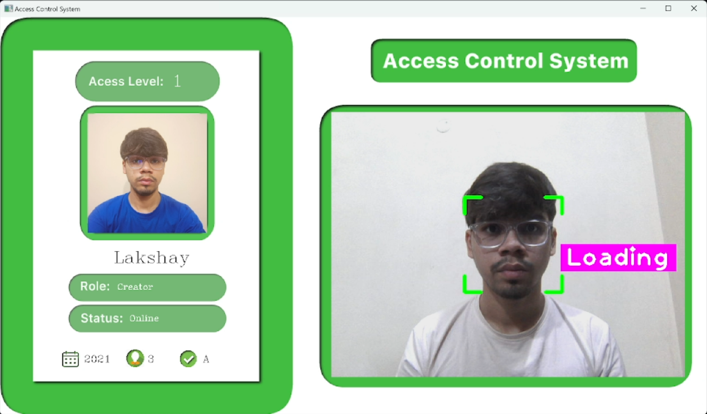

# Access Control System

This project is an Access Control System developed using Python and integrated with Firebase for real-time user authentication and management. It utilizes facial recognition technology to grant access to registered users based on their facial features.

<div style="text-align:center">
    
    
</div>

## Features

- **Facial Recognition:** The system uses face recognition algorithms to identify registered users.
- **Real-time Access Control:** Grants or denies access based on the recognition result and user's access level.
- **Firebase Integration:** Utilizes Firebase for user authentication, data storage, and real-time database operations.
- **User Management:** Allows adding new users to the system along with their access levels and other relevant information.

## Requirements

- Python 3.x
- OpenCV
- face_recognition
- cvzone
- Firebase Admin SDK

## Installation

1. Clone the repository to your local machine:

   ```bash
   git clone <repository-url>


2. Install the required Python packages:

    ```bash
    pip install -r requirements.txt


3. Obtain the Firebase service account key (serviceAccountKey.json) and place it in the project directory.

4. Run the scripts in the following order:
* `generate_encodings.py`: Generates encodings for known user faces and saves them to `EncodeFile.p`.
* `add_user_data.py`: Adds sample user data to the Firebase Realtime Database.
* `acs.py`: Executes the acs access control system.


## Usage

1. Ensure that your webcam is connected and properly configured.
2. Run the acs.py script:
    ```bash
    python acs.py
3. The system will start detecting faces in the webcam feed and grant access to recognized users based on their access levels.

## Configuration

* **Firebase Configuration**: Modify the Firebase credentials in the acs.py, generate_encodings.py, and add_user_data.py scripts to match your Firebase project configuration.

## Resources

* [OpenCV Documentation](https://opencv.org/)
* [face_recognition by Adam Geitgey](https://github.com/ageitgey/face_recognition)
* [cvzone](https://github.com/cvzone/cvzone)
* [Firebase](https://firebase.google.com/)
* [Machine Learning is Fun by Adam Geitgey](https://medium.com/@ageitgey/machine-learning-is-fun-80ea3ec3c471)
* [Murtaza's Workshop - Robotics and AI ](https://www.youtube.com/@murtazasworkshop)
* [Murtaza's Workshop - Robotics and AI ](https://www.youtube.com/@murtazasworkshop)